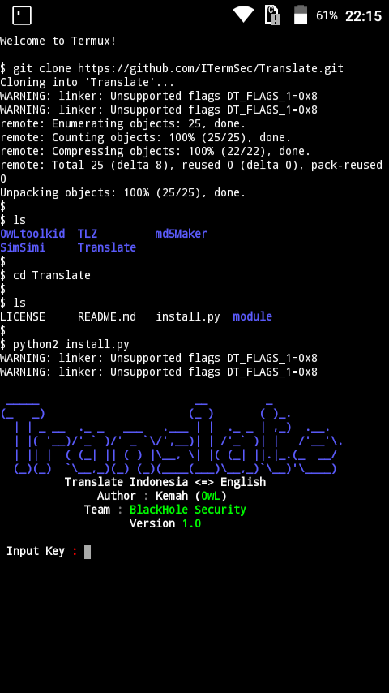
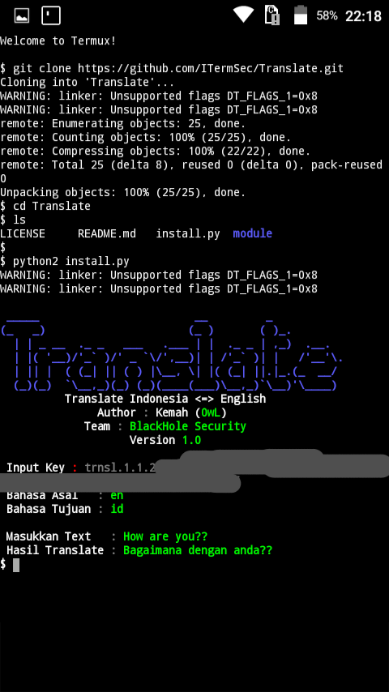
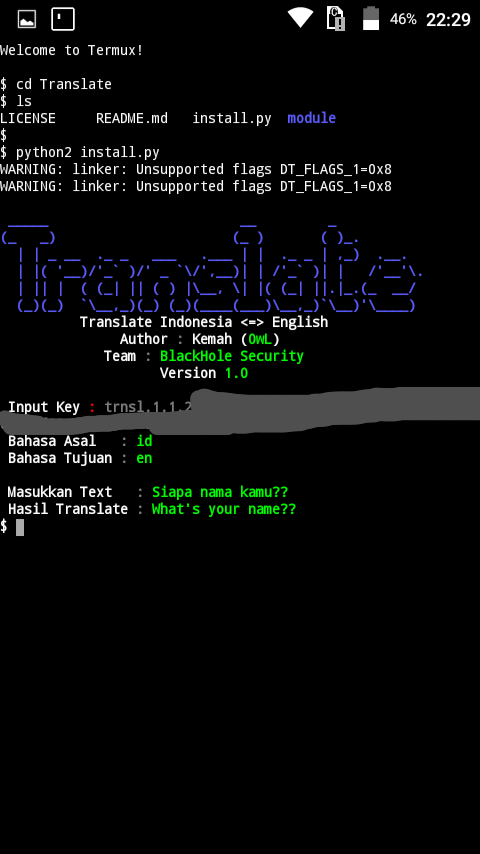

# Translate
Translate Indonesia - Inggris / Inggris - Indonesia 

Indonesia = id

Inggris = en

With API_KEY.
# Register API_KEY
Link Register : https://passport.yandex.com/registration?origin=translate&retpath=https%3A%2F%2Ftranslate.yandex.com%2Fdevelopers%2Fkeys
# Install
```bash
$ apt install git
$ pkg install python2
$ git clone https://ITermSec/Translate.git
$ cd Translate
$ python2 install.py
```
# Screenshot
 

